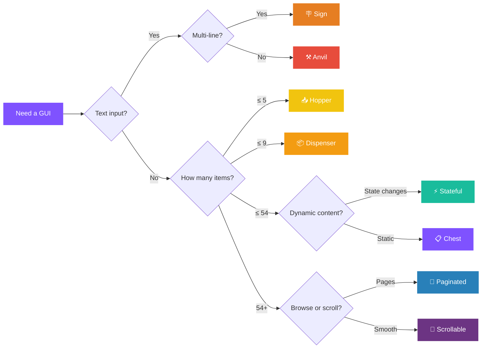
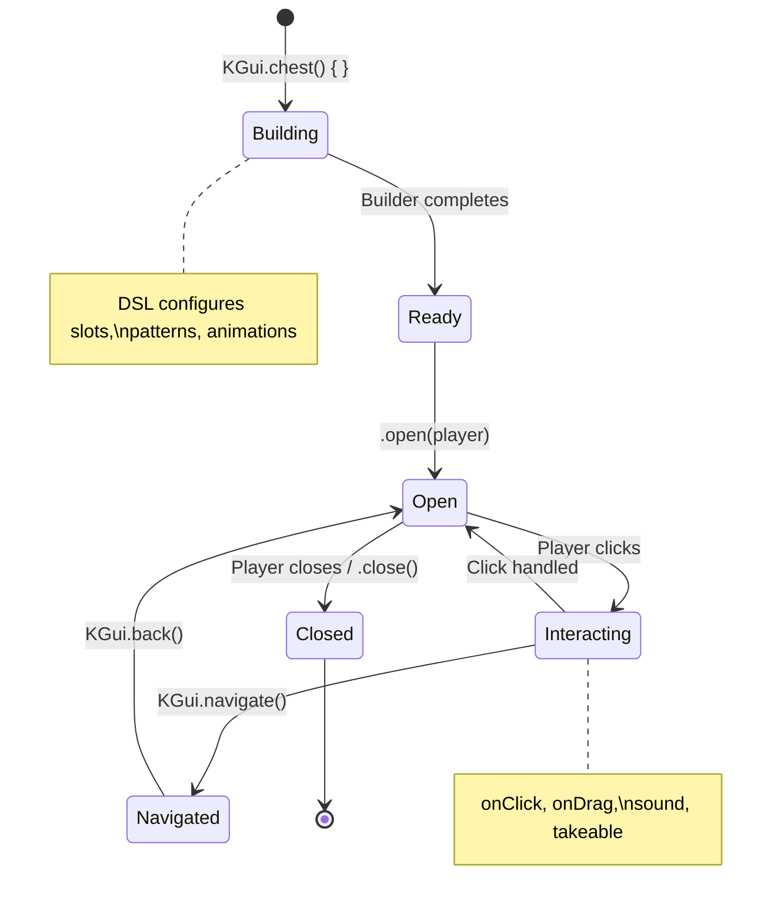

<div align="center">


<br/>

[](https://jitpack.io/#maquqdev/KGui)
[](LICENSE)
[](https://kotlinlang.org)
[](https://papermc.io)
[](https://openjdk.org)

**Build interactive inventory GUIs with a type-safe Kotlin DSL. No boilerplate. No raw inventory listeners.**

[📖 Wiki](https://github.com/maquqdev/KGui/wiki) · [🐛 Issues](https://github.com/maquqdev/KGui/issues) · [📦 JitPack](https://jitpack.io/#maquqdev/KGui)

---

### 🪄 What you write

```kotlin
val shop = KGui.chest(plugin, "<gold>Shop", rows = 3) {
    border(Material.GRAY_STAINED_GLASS_PANE) { name(" ") }
    slot(13) {
        item(Material.DIAMOND_SWORD) { name("<gold>Buy Sword"); lore("<gray>Click to buy"); glow() }
        sound(Sound.UI_BUTTON_CLICK)
        onClick { player -> player.sendMessage("Purchased!") }
    }
}
shop.open(player)
```

### 🎮 What your players see

```
╔═══╦═══╦═══╦═══╦═══╦═══╦═══╦═══╦═══╗
║ ▪ ║ ▪ ║ ▪ ║ ▪ ║ ▪ ║ ▪ ║ ▪ ║ ▪ ║ ▪ ║  ▪ = glass border
╠═══╬═══╬═══╬═══╬═══╬═══╬═══╬═══╬═══╣
║ ▪ ║   ║   ║   ║ ⚔ ║   ║   ║   ║ ▪ ║  ⚔ = diamond sword
╠═══╬═══╬═══╬═══╬═══╬═══╬═══╬═══╬═══╣
║ ▪ ║ ▪ ║ ▪ ║ ▪ ║ ▪ ║ ▪ ║ ▪ ║ ▪ ║ ▪ ║
╚═══╩═══╩═══╩═══╩═══╩═══╩═══╩═══╩═══╝
```

> Listeners, item building, click routing, extraction prevention — **all handled for you.**

</div>

---

## ⚡ Why KGui?

<table>
<tr>
<td width="50%">

### 🚫 Raw Bukkit
```kotlin
class ShopMenu(val plugin: JavaPlugin) {
    fun open(player: Player) {
        val inv = Bukkit.createInventory(null, 27,
            Component.text("Shop"))

        val sword = ItemStack(Material.DIAMOND_SWORD)
        val meta = sword.itemMeta!!
        meta.displayName(Component.text("Buy Sword")
            .color(NamedTextColor.GOLD))
        meta.lore(listOf(
            Component.text("Click to buy")
                .color(NamedTextColor.GRAY)))
        sword.itemMeta = meta
        inv.setItem(13, sword)

        player.openInventory(inv)
    }
}

// + InventoryClickEvent listener
// + cancel drag events
// + check inventory holder
// + handle close cleanup
// ...50+ lines of boilerplate
```

</td>
<td width="50%">

### ✅ KGui
```kotlin
val shop = KGui.chest(plugin, "<gold>Shop", rows = 3) {
    border(Material.GRAY_STAINED_GLASS_PANE) {
        name(" ")
    }

    slot(13) {
        item(Material.DIAMOND_SWORD) {
            name("<gold>Buy Sword")
            lore("<gray>Click to buy")
            glow()
        }
        sound(Sound.UI_BUTTON_CLICK)
        onClick { player ->
            player.sendMessage("Purchased!")
        }
    }
}
shop.open(player)


// ✅ Click handling — automatic
// ✅ Drag prevention — automatic
// ✅ Close cleanup — automatic
// ✅ MiniMessage formatting — built-in
```

</td>
</tr>
</table>

---

## 🧩 Features

<table>
<tr>
<td>

### 🏗️ GUI Types


</td>
<td>

### 🔧 Input & Small


</td>
</tr>
<tr>
<td>

### 📦 Building Blocks


</td>
<td>

### 🔒 Control & Navigation


</td>
</tr>
</table>

---

## 🗺️ Pick Your GUI Type

> Not sure which GUI type to use? Follow the arrows:



---

## 🚀 Quick Start

### 1️⃣ Add the dependency

```kotlin
// build.gradle.kts
repositories {
    maven("https://jitpack.io")
}

dependencies {
    implementation("com.github.maquqdev.KGui:kgui-core:v1.0.0")
}
```

<details>
<summary>📋 Maven</summary>

```xml
<repositories>
    <repository>
        <id>jitpack.io</id>
        <url>https://jitpack.io</url>
    </repository>
</repositories>

<dependency>
    <groupId>com.github.maquqdev.KGui</groupId>
    <artifactId>kgui-core</artifactId>
    <version>v1.0.0</version>
</dependency>
```

</details>

### 2️⃣ Initialize in your plugin

```kotlin
class MyPlugin : JavaPlugin() {
    override fun onEnable() {
        KGui.setup(this)
    }
}
```

### 3️⃣ Create a GUI

```kotlin
val menu = KGui.chest(plugin, "<dark_purple>Main Menu", rows = 3) {
    border(Material.GRAY_STAINED_GLASS_PANE) { name(" ") }

    slot(13) {
        item(Material.COMPASS) {
            name("<yellow>Server Info")
            lore("<gray>Click for details")
        }
        sound(Sound.UI_BUTTON_CLICK)
        onClick { player -> player.sendMessage("Hello!") }
    }
}
menu.open(player)
```

> [!TIP]
> Slot numbering starts at `0` (top-left) and goes left-to-right, top-to-bottom. For a 3-row chest, slot `13` is the center of the middle row.

---

## 📚 Examples

<details>
<summary><b>📄 Paginated List</b></summary>

Browse hundreds of items across multiple pages with automatic navigation:

```kotlin
val gui = KGui.paginated(plugin, "<blue>All Items", rows = 6) {
    border(Material.BLACK_STAINED_GLASS_PANE) { name(" ") }

    items(Material.entries.filter { it.isItem }) { mat ->
        item(mat) { name("<white>${mat.name.lowercase().replace('_', ' ')}") }
        onClick { player -> player.inventory.addItem(ItemBuilder(mat).build()) }
    }

    previousButton(48, Material.ARROW) { name("<yellow>← Previous") }
    nextButton(50, Material.ARROW) { name("<yellow>Next →") }
    pageInfo(49) { current, max ->
        ItemBuilder(Material.PAPER).name("<gray>Page $current/$max").build()
    }
}
```

```
╔═══╦═══╦═══╦═══╦═══╦═══╦═══╦═══╦═══╗
║ ▪ ║ ▪ ║ ▪ ║ ▪ ║ ▪ ║ ▪ ║ ▪ ║ ▪ ║ ▪ ║
╠═══╬═══╬═══╬═══╬═══╬═══╬═══╬═══╬═══╣
║ 🪨 ║ 🪵 ║ 🧱 ║ 🔷 ║ 🟡 ║ 🔴 ║ 🟢 ║ ⬜ ║ ⬛ ║  ← paginated content
║   ║   ║   ║   ║   ║   ║   ║   ║   ║
║   ║   ║   ║   ║   ║   ║   ║   ║   ║
╠═══╬═══╬═══╬═══╬═══╬═══╬═══╬═══╬═══╣
║ ▪ ║ ▪ ║ ▪ ║ ◄ ║ 📄 ║ ► ║ ▪ ║ ▪ ║ ▪ ║  ◄ prev  📄 page  ► next
╚═══╩═══╩═══╩═══╩═══╩═══╩═══╩═══╩═══╝
```

</details>

<details>
<summary><b>⚡ Reactive State</b></summary>

GUI that automatically re-renders when state changes — no manual `update()` calls:

```kotlin
val gui = KGui.stateful(plugin, "<gold>Counter", rows = 3) {
    var clicks by state("clicks", 0)

    border(Material.ORANGE_STAINED_GLASS_PANE) { name(" ") }

    render { player ->
        setSlot(GuiSlot(
            index = 13,
            item = ItemBuilder(Material.DIAMOND)
                .name("<aqua>Clicks: <white>$clicks")
                .amount(maxOf(1, minOf(64, clicks)))
                .build(),
            onClick = { _, _ -> clicks++ }
        ))
    }
}
```

> [!NOTE]
> The `state()` delegate triggers a re-render on every write. You never call `update()` manually — just mutate the state and the GUI refreshes.

</details>

<details>
<summary><b>🎨 Pattern Layout</b></summary>

Define GUI layouts visually using character patterns:

```kotlin
val gui = KGui.chest(plugin, "<purple>Pattern Menu", rows = 5) {
    pattern {
        lines(
            "XXXXXXXXX",
            "X.......X",
            "X..ABA..X",
            "X.......X",
            "XXXXXXXXX"
        )
        'X' means filler(Material.BLACK_STAINED_GLASS_PANE) { name(" ") }
        'A' means clickable(Material.EMERALD) {
            item { name("<green>Option A") }
            onClick { p, _ -> p.sendMessage("Chose A!") }
        }
        'B' means clickable(Material.DIAMOND) {
            item { name("<aqua>Option B") }
            onClick { p, _ -> p.sendMessage("Chose B!") }
        }
    }
}
```

What the pattern maps to:

```
X X X X X X X X X       ▪ ▪ ▪ ▪ ▪ ▪ ▪ ▪ ▪
X . . . . . . . X       ▪               ▪
X . . A B A . . X  →    ▪   💎 🔷 💎    ▪
X . . . . . . . X       ▪               ▪
X X X X X X X X X       ▪ ▪ ▪ ▪ ▪ ▪ ▪ ▪ ▪
```

</details>

<details>
<summary><b>🔒 Item Extraction Control</b></summary>

Fine-grained control over which items players can take:

```kotlin
val gui = KGui.chest(plugin, "<red>Reward Chest", rows = 3) {
    // GUI locked by default (interactable = false)

    slot(11) {
        item(Material.BARRIER) { name("<red>Locked") }
        // Can't take — follows GUI default
    }

    slot(13) {
        item(Material.GOLDEN_APPLE) { name("<green>Take me!") }
        takeable(true) // Override: CAN take despite GUI being locked
    }

    slot(15) {
        item(Material.DIAMOND) { name("<red>Never") }
        takeable(false) // Explicitly locked
    }
}
```

| `gui.interactable` | `slot.takeable` | Can take? |
|:---:|:---:|:---:|
| `false` | `null` | ❌ No (default) |
| `false` | `true` | ✅ **Yes** |
| `true` | `null` | ✅ Yes |
| `true` | `false` | ❌ **No** |

</details>

<details>
<summary><b>🏪 Merchant Trades</b></summary>

Villager-style trading interface:

```kotlin
val gui = KGui.merchant(plugin, "<green>Weapon Shop") {
    trade {
        result(Material.DIAMOND_SWORD) {
            name("<gold>Sharp Sword")
            enchant(Enchantment.SHARPNESS, 5)
        }
        ingredient(Material.EMERALD) { amount(10) }
        ingredient(Material.IRON_SWORD)
        maxUses = 5
    }
    onTrade { player, index -> player.sendMessage("Purchased trade #${index + 1}!") }
}
```

</details>

<details>
<summary><b>🔀 Navigation Stack</b></summary>

Navigate between GUIs with automatic back history:

```kotlin
// Navigate forward (pushes current GUI onto stack)
KGui.navigate(player, shopGui)

// Go back to previous GUI
KGui.back(player)

// Back button in any GUI
slot(49) {
    item(Material.ARROW) { name("<gray>← Back") }
    onClick { player ->
        if (!KGui.back(player)) player.closeInventory()
    }
}
```

```
┌──────────┐     ┌──────────┐     ┌──────────┐
│ Main Menu│ ──► │  Shop    │ ──► │ Confirm  │
│          │ ◄── │          │ ◄── │          │
└──────────┘     └──────────┘     └──────────┘
     back()           back()
```

</details>

<details>
<summary><b>✏️ Text Input (Anvil & Sign)</b></summary>

```kotlin
// Anvil input with validation
val gui = KGui.anvil(plugin, "<yellow>Enter Name") {
    inputItem(Material.NAME_TAG) { name("<gray>Type here...") }
    defaultText("Steve")
    onSubmit { player, text ->
        if (text.length < 3) { player.sendMessage("Too short!"); false }
        else { player.sendMessage("Name: $text"); true }
    }
}

// Sign input
val sign = KGui.sign(plugin) {
    line(0, "Enter your")
    line(1, "message below")
    onComplete { player, lines -> player.sendMessage("You wrote: ${lines[2]}") }
}
```

```
 Anvil:                          Sign:
┌─────────────────────┐         ┌─────────────┐
│ [Name Tag]  →  [✓]  │         │ Enter your  │
│  "Steve"        │    │         │ msg below   │
│              result  │         │ ________    │
└─────────────────────┘         │             │
                                └─────────────┘
```

</details>

<details>
<summary><b>🎬 Animations</b></summary>

Frame-based slot animations for loading spinners, status indicators, or decorative effects:

```kotlin
slot(13) {
    animate(intervalTicks = 5) {
        frame { item(Material.RED_WOOL) { name("<red>Loading.") } }
        frame { item(Material.ORANGE_WOOL) { name("<gold>Loading..") } }
        frame { item(Material.YELLOW_WOOL) { name("<yellow>Loading...") } }
        frame { item(Material.LIME_WOOL) { name("<green>Done!") } }
        loop = true
    }
}
```

```
 frame 1     frame 2     frame 3     frame 4
┌───────┐   ┌───────┐   ┌───────┐   ┌───────┐
│  🟥   │ → │  🟧   │ → │  🟨   │ → │  🟩   │ → (loop)
│  .    │   │  ..   │   │  ...  │   │ Done! │
└───────┘   └───────┘   └───────┘   └───────┘
```

</details>

---

## 🧮 Slot Reference

<div align="center">

```
                     3-Row Chest (27 slots)

          0    1    2    3    4    5    6    7    8
        ┌────┬────┬────┬────┬────┬────┬────┬────┬────┐
Row 0   │  0 │  1 │  2 │  3 │  4 │  5 │  6 │  7 │  8 │
        ├────┼────┼────┼────┼────┼────┼────┼────┼────┤
Row 1   │  9 │ 10 │ 11 │ 12 │ 13 │ 14 │ 15 │ 16 │ 17 │
        ├────┼────┼────┼────┼────┼────┼────┼────┼────┤
Row 2   │ 18 │ 19 │ 20 │ 21 │ 22 │ 23 │ 24 │ 25 │ 26 │
        └────┴────┴────┴────┴────┴────┴────┴────┴────┘

     Formula:  slot = (row × 9) + column
     Center:   rows × 9 ÷ 2  (e.g. 3×9÷2 = 13)
```

</div>

<details>
<summary>📐 6-Row Chest (54 slots)</summary>

```
          0    1    2    3    4    5    6    7    8
        ┌────┬────┬────┬────┬────┬────┬────┬────┬────┐
Row 0   │  0 │  1 │  2 │  3 │  4 │  5 │  6 │  7 │  8 │
        ├────┼────┼────┼────┼────┼────┼────┼────┼────┤
Row 1   │  9 │ 10 │ 11 │ 12 │ 13 │ 14 │ 15 │ 16 │ 17 │
        ├────┼────┼────┼────┼────┼────┼────┼────┼────┤
Row 2   │ 18 │ 19 │ 20 │ 21 │ 22 │ 23 │ 24 │ 25 │ 26 │
        ├────┼────┼────┼────┼────┼────┼────┼────┼────┤
Row 3   │ 27 │ 28 │ 29 │ 30 │ 31 │ 32 │ 33 │ 34 │ 35 │
        ├────┼────┼────┼────┼────┼────┼────┼────┼────┤
Row 4   │ 36 │ 37 │ 38 │ 39 │ 40 │ 41 │ 42 │ 43 │ 44 │
        ├────┼────┼────┼────┼────┼────┼────┼────┼────┤
Row 5   │ 45 │ 46 │ 47 │ 48 │ 49 │ 50 │ 51 │ 52 │ 53 │
        └────┴────┴────┴────┴────┴────┴────┴────┴────┘
```

</details>

<details>
<summary>📐 Hopper & Dispenser</summary>

```
 Hopper (5 slots)              Dispenser (9 slots)

┌────┬────┬────┬────┬────┐     ┌────┬────┬────┐
│  0 │  1 │  2 │  3 │  4 │     │  0 │  1 │  2 │
└────┴────┴────┴────┴────┘     ├────┼────┼────┤
                                │  3 │  4 │  5 │
                                ├────┼────┼────┤
                                │  6 │  7 │  8 │
                                └────┴────┴────┘
```

</details>

---

## 🗂️ All GUI Types

| Type | Factory | Slots | Best for |
|:-----|:--------|:------|:---------|
|  | `KGui.chest()` | 9-54 | Standard menus, shops, settings |
|  | `KGui.paginated()` | 18-54 | Browsing large item lists |
|  | `KGui.scrollable()` | 18-54 | Smooth content scrolling |
|  | `KGui.stateful()` | 9-54 | Reactive UIs, counters, toggles |
|  | `KGui.anvil()` | 3 | Single-line text input |
|  | `KGui.sign()` | — | Multi-line text input |
|  | `KGui.hopper()` | 5 | Compact horizontal choices |
|  | `KGui.dispenser()` | 9 | Compact 3×3 grid |
|  | `KGui.merchant()` | — | Villager-style trading |

---

## ⚙️ Lifecycle



---

## 📖 Documentation

Full documentation is available on the **[Wiki](https://github.com/maquqdev/KGui/wiki)**:

| Page | Description |
|:-----|:------------|
| **[Getting Started](https://github.com/maquqdev/KGui/wiki/Getting-Started)** | Setup, first GUI, slot numbering |
| **[ItemBuilder](https://github.com/maquqdev/KGui/wiki/ItemBuilder)** | Fluent ItemStack creation API |
| **[Chest GUI](https://github.com/maquqdev/KGui/wiki/Chest-GUI)** | Standard inventory menus |
| **[Paginated GUI](https://github.com/maquqdev/KGui/wiki/Paginated-GUI)** | Multi-page lists |
| **[Scrollable GUI](https://github.com/maquqdev/KGui/wiki/Scrollable-GUI)** | Scrollable content areas |
| **[Stateful GUI](https://github.com/maquqdev/KGui/wiki/Stateful-GUI)** | Reactive state management |
| **[Anvil & Sign Input](https://github.com/maquqdev/KGui/wiki/Anvil-and-Sign-Input)** | Text input GUIs |
| **[Hopper & Dispenser](https://github.com/maquqdev/KGui/wiki/Hopper-and-Dispenser-GUI)** | Small inventory menus |
| **[Merchant GUI](https://github.com/maquqdev/KGui/wiki/Merchant-GUI)** | Villager trades |
| **[Pattern Layouts](https://github.com/maquqdev/KGui/wiki/Pattern-Layouts)** | Character-based layouts |
| **[Templates](https://github.com/maquqdev/KGui/wiki/Templates)** | Reusable layout presets |
| **[Animations](https://github.com/maquqdev/KGui/wiki/Animations)** | Frame-based slot animations |
| **[Item Extraction](https://github.com/maquqdev/KGui/wiki/Item-Extraction-Control)** | interactable + takeable control |
| **[Navigation](https://github.com/maquqdev/KGui/wiki/Navigation)** | Back/forward GUI history |
| **[Events](https://github.com/maquqdev/KGui/wiki/Events)** | Custom Bukkit events |

---

## 🤝 Contributing

Contributions are welcome. Please open an issue to discuss larger changes before submitting a PR.

1. Fork the repository
2. Create a feature branch
3. Submit a pull request

## 📄 License

[MIT](LICENSE)
<div align="center">

</div>